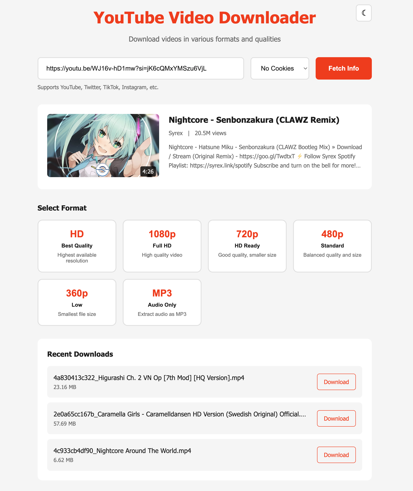
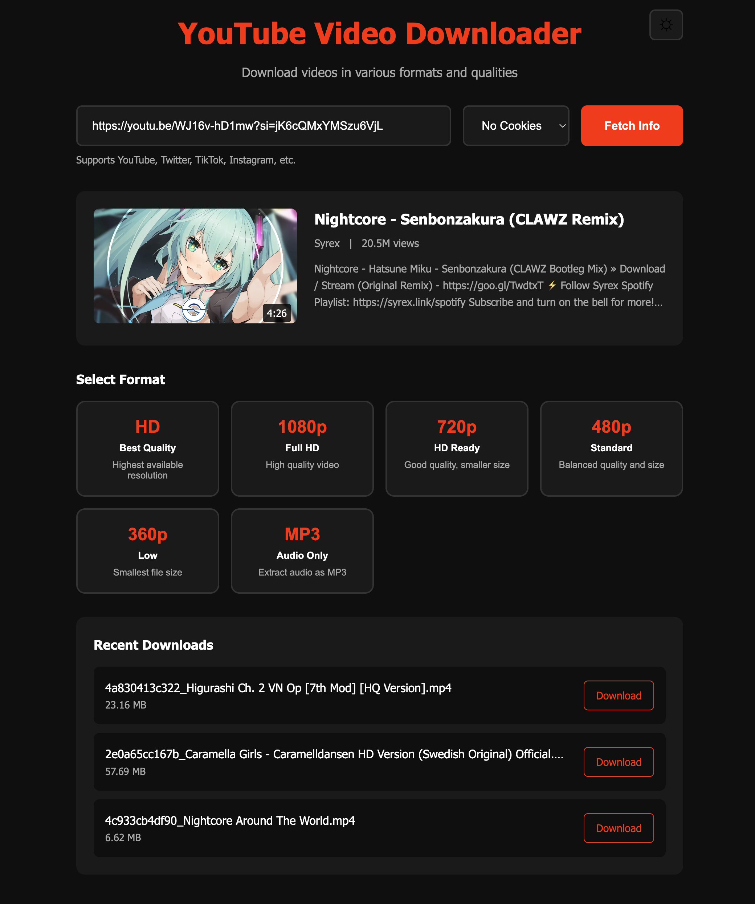

# YouTube Video Downloader

A self-hosted web app for downloading YouTube videos using yt-dlp.




## Features

- Download videos in multiple qualities (Best/4K, 1080p, 720p, 480p, 360p)
- Extract audio as MP3 or FLAC (lossless)
- Supports YouTube, Twitter, TikTok, Instagram, and more
- Progress tracking with speed and ETA
- Dark/light theme toggle
- Browser cookie support for restricted content
- Shared download history across all devices on your network
- One-click yt-dlp updates from the web UI
- Works on macOS, Linux, and Windows
- **Authentication** - Password protect your server

## System Requirements

- **Python 3.10+** (3.12 recommended)
- **ffmpeg** (for video/audio processing)
- **Node.js** (for YouTube signature solving)
- **Docker** (for YouTube PO token server)

## Quick Start

### 1. Clone the repo

```bash
git clone https://github.com/Cannibal420/yt-download.git
cd yt-download
```

### 2. Install system dependencies

**macOS (Homebrew):**
```bash
brew install python@3.12 node ffmpeg docker
```

**Ubuntu/Debian:**
```bash
sudo apt update && sudo apt install python3 python3-venv nodejs ffmpeg docker.io
```

**Windows:**
```powershell
winget install Python.Python.3.12
winget install OpenJS.NodeJS
winget install Gyan.FFmpeg
winget install Docker.DockerDesktop
```

### 3. Set up virtual environment (macOS/Linux only)

```bash
python3 -m venv venv
source venv/bin/activate
```

### 4. Install Python dependencies

```bash
pip install -r requirements.txt
pip install yt-dlp-ejs bgutil-ytdlp-pot-provider yt-dlp-get-pot
```

### 5. Start Docker PO Token Server (Required for YouTube)

YouTube requires Proof of Origin tokens. Start the server:

```bash
docker run -d --name pot-server -p 4416:4416 --restart unless-stopped brainicism/bgutil-ytdlp-pot-provider
```

### 6. Run the app

```bash
python app.py
```

### 7. Open in browser

```
http://localhost:5051
```

Default login: `admin` / `changeme`

### 8. Access from your phone (optional)

When the server starts, it displays a network URL:

```
[*] Local:   http://localhost:5051
[*] Network: http://192.168.x.x:5051  <- Use this on your phone

[*] Authentication ENABLED
    Username: admin
    Password: ********
```

Make sure your phone is on the same Wi-Fi network. You'll be prompted to log in.

## Authentication

The server requires a username and password by default. Configure via environment variables:

```bash
# Set custom credentials
export YT_AUTH_USER="myusername"
export YT_AUTH_PASS="mysecretpassword"
python app.py

# Or disable authentication entirely (not recommended for shared networks)
export YT_AUTH_ENABLED=false
python app.py
```

| Variable | Default | Description |
|----------|---------|-------------|
| `YT_AUTH_ENABLED` | `true` | Enable/disable authentication |
| `YT_AUTH_USER` | `admin` | Username |
| `YT_AUTH_PASS` | `changeme` | Password |

## Rate Limiting

To prevent abuse, downloads are rate limited:

- **10 downloads per 10 minutes** per IP address
- Uses a sliding window (each download "expires" after 10 minutes)
- Update yt-dlp has a **5 minute cooldown** between updates

## Usage

1. Paste a YouTube URL
2. Select your browser (for cookie auth)
3. Click "Fetch Info"
4. Choose quality/format
5. Wait for download
6. Click "Save File"

## Browser Cookies

For age-restricted or private videos, select your browser from the dropdown. Make sure you're logged into YouTube on that browser.

## Troubleshooting

### "The downloaded file is empty"

This means YouTube is blocking the download. Check:

1. **Docker PO token server is running:**
   ```bash
   docker ps | grep pot-server
   docker start pot-server  # if not running
   ```

2. **Node.js is installed:**
   ```bash
   node --version
   ```

3. **Try selecting your browser** for cookie authentication

4. **Update yt-dlp:**
   ```bash
   pip install --upgrade yt-dlp
   ```

### "ffmpeg not found"

Make sure ffmpeg is installed and in your PATH.

### "403 Forbidden"

- Ensure Docker PO token server is running
- Try selecting your browser for cookie authentication
- Make sure you're logged into YouTube

### "Sign in to confirm you're not a bot"

Select your browser from the dropdown (must be logged into YouTube).

### "Rate limit exceeded"

Wait for the cooldown period shown in the error message.

## Tech Stack

- Python / Flask
- Vanilla JS / CSS

## Disclaimer

This tool is for personal use only. Respect copyright laws and YouTube's Terms of Service.
